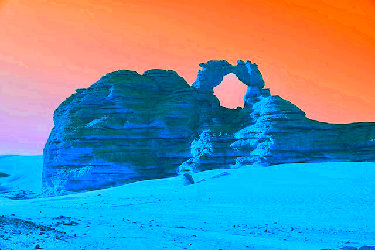

[package]: readme/package_as_jar.png

# DAI-practical-work-1 (aka BIM - Basic Image Manipulation)
This project was realized by Dylan Langumier and Raphaël Perret in the scope of the DAI class, followed at HEIG-VD.

---
# Purpose
This is a small CLI application allowing you to apply some basic filters on top of BMPs.

---
## Featured filters
- moving average (1 argument)
- grayscale filter (1 argument)
- sepia filter (no arguments taken)
- color intensity (1 argument)
- color adjusting (4 arguments)

## Pre-requisite
This application was built against Java 21, and thus requires Java 21+ to run.

### Supported file format
Due to the lack of time we've had, we are only supporting bitmap whose headers are `BITMAPINFOHEADER`.

# Get the files locally
## Clone
First you will need to clone the application using Git
```bash
git clone https://github.com/Dylan-Langumier/DAI-practical-work-1.git
```

## Download source code
Or by downloading the [source code](https://github.com/Dylan-Langumier/DAI-practical-work-1/archive/refs/heads/master.zip)
and then unzipping in into a directory.

# How to build
## From Intellij IDEA


Select `Package application as JAR file`, and run the configuration. This will output the JAR file in the [target](./target) folder.

Note: this will run `spotless:apply` before actually packaging the application to beautify the code styling.

## From your CLI

If you have Maven installed
```bash
mvn dependency:go-offline clean compile package
```

If you do not have Maven, we included a Maven Wrapper, which you can use to build the application:
```bash
./mvnw dependency:go-offline clean compile package
```
--- 
# Get started
## Help
To run the application, you can start with the basic help command
```bash
java -jar ./target/BIM-1.0.jar --help
```
```
Usage: classes [-hV] -f=<filter> <filepath> <outputFilepath> <p> [COMMAND]
CLI to apply basic filters on images
      <filepath>          The file path of the image.
      <outputFilepath>    The file path of the output image.
      <p>                 Parameters of the filter (the required amount depends
                            on the chosen filter)
  -f, --filter=<filter>   The filter to apply on the image (possible values:
                            SEPIA, GRAYSCALE, MOVING_AVERAGE, COLOR_INTENSITY,
                            ADJUST_COLOR).
  -h, --help              Show this help message and exit.
  -V, --version           Print version information and exit.
Commands:
  apply  Apply a filter.
```
--- 
# Applying a filter
We included some BMP files you can test the application on.

## Grayscale
This converts an image to grayscale by averaging each pixel's RGB values, with an intensity factor controlling how strong the grayscale effect is.  
The intensity can be set between 0 (turns the image black) and 100 (full grayscale)
```bash
java -jar ./target/BIM-1.0.jar ./test_images/desert.bmp ./test_images/desert-gray.bmp -f grayscale <intensity> apply
```


## Sepia
This filter does not take any extra parameter, as it was deemed irrelevant for it.  
It applies a [sepia](https://en.wikipedia.org/wiki/Sepia_(color)) tone effect to an image by adjusting each pixel's RGB values based on predefined weights.  
This filter transforms the image to give it a warm, brownish tint, emulating an antique photo effect

```bash
java -jar ./target/BIM-1.0.jar ./test_images/desert.bmp ./test_images/desert-sepia.bmp -f sepia apply
```


## Moving Average
This applies a moving average filter to an image, smoothing pixel colors by averaging the RGB values of surrounding pixels within a defined square area.  
The size of the square is specified by the input argument, and the filter ensures pixel values stay within valid boundaries.  
Each pixel's color is replaced by the average color of neighboring pixels, creating a blur effect.  
Note: the stronger the intensity, the longer you will need to wait to get an output.

```bash
java -jar ./target/BIM-1.0.jar ./test_images/desert.bmp ./test_images/desert-mv_avg.bmp -f moving_average <intensity> apply
```


## Play with colors
### Color Intensity
This filter adjusts the intensity of colors in an image, either enhancing or reducing them based on the input value.  
Positive values increase intensity, while negative values invert colors.
```bash
java -jar ./target/BIM-1.0.jar ./test_images/desert.bmp ./test_images/desert-color.bmp -f color_intensity <intensity> apply
```




### Adjust color
This is an image filter that adjusts the colors of an image towards a target color based on a specified intensity.  
It takes four arguments: the target color's RGB values and an intensity percentage.  
It then modifies each pixel of the image by blending the original color with the target color according to the intensity level.
```bash
java -jar ./target/BIM-1.0.jar ./test_images/desert.bmp ./test_images/desert-adjusted.bmp -f adjust_color <r> <g> <b> <intesity> apply
```


--- 

# External Dependencies
We decided to use the following classes:
- `java.lang.Math` in order to use `Math.clamp(value, min, max)` which forces the value to be in the interval `[min, max]`.  
Looks cleaner, and saves a few lines.
- `java.awt.Color` this class already exists and we found it redundant needing to rewrite it.  
We are only using the constructors and getRed, getGreen, getBlue and getAlpha methods. 
